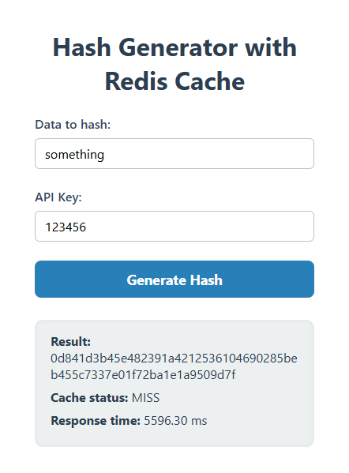
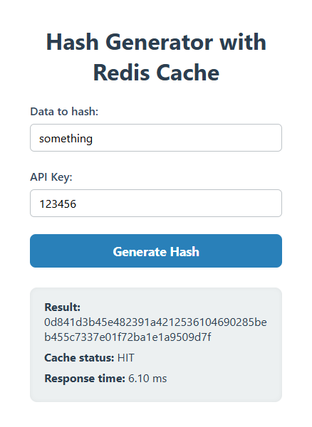
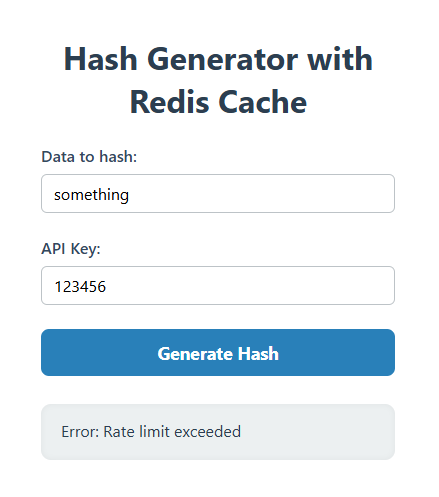

# Redis POC
This is a proof-of-concept projet to showcase some Redis use cases.

## Features
### Caching
The client sends some data to an API endpoint which the server then recursively hashes (SHA256) 10 million times.
This is to simulate some expensive compute function that would take a long time to execute.  
When the server responds with the final hash, it includes an X-Cache header indicating whether the result was found in cache or not.  
The client displays the hash, whether the server found the result in cache, and the time it took for the response.

### Rate Limiting
Additionally, Redis can be used to keep track of the amount of requests per API key and rate limit users.
There is an API Key field in the form that gets sent along with the data to the API endpoint.
The server will rate limit requests if there are more than 5 requests per minute per API key.  
Because this is just a proof of concept, there is no way to validate the API keys,

## Installation & Usage
This project uses two docker containers:
* Redis (In-memory NoSQL DB used for caching)
* Node.js (JavaScript runtime using the Express.js backend framework)

To run the containers, execute `docker compose up --build` in this directory.  
The frontend will be available at `http://localhost:3000`.

## Demo
### Caching
To test if the caching works, enter some text into the data field in the form and click "Generate Hash".  

      

  

As you can see, the response is very slow, taking over 5 seconds to get a response.  
Now, click "Generate Hash" a second time.  

      

  
The response time is significantly faster (now just a few milliseconds) and it indicates that it found the query in cache.

### Rate Limiting
To verify that the rate limit works, click the "Generate Hash" button more than 5 times with the same API key in under a minute. The server will then instanly respond with a 429 status code and save compute ressources.  

      

   